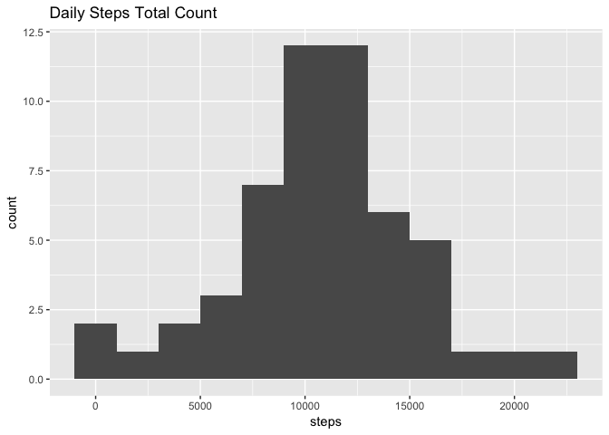
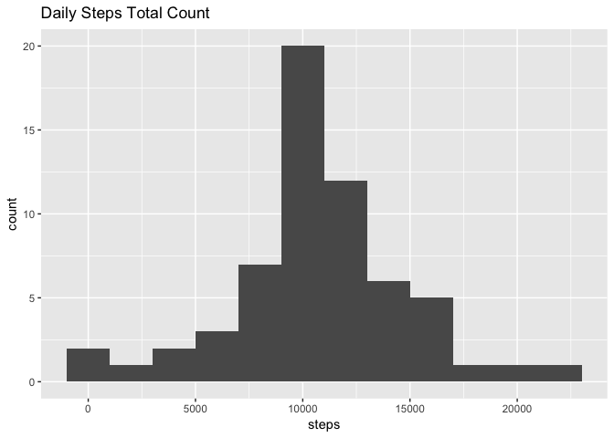

# Reproducible Research: Peer Assessment 1


## Loading and preprocessing the data

#### load the data from local file and transform the date variable to date type


```r
# use data.table instead of data
library(data.table)
dt <- fread("activity.csv", na.strings = "NA")
# transform date variable from string to date type
dt$date <- with(dt, as.Date(date, "%Y-%m-%d"))
```

take a look at data format


```r
str(dt)
```

```
## Classes 'data.table' and 'data.frame':	17568 obs. of  3 variables:
##  $ steps   : int  NA NA NA NA NA NA NA NA NA NA ...
##  $ date    : Date, format: "2012-10-01" "2012-10-01" ...
##  $ interval: int  0 5 10 15 20 25 30 35 40 45 ...
##  - attr(*, ".internal.selfref")=<externalptr>
```

## What is mean total number of steps taken per day?

*For this part of the assignment, you can ignore the missing values in the dataset.*

#### Make a histogram of the total number of steps taken each day

```r
library(ggplot2)
# calculate steps per day
stepsPerDay <- aggregate(steps ~ date, data = dt, sum)
# draw the chart
ggplot(stepsPerDay, aes(x = steps)) + 
  geom_histogram(binwidth = 2000) + labs(title = "Daily Steps Total Count")
```

<!-- -->

#### Calculate and report the mean and median total number of steps taken per day

```r
meanPerDay <- mean(stepsPerDay$steps, na.rm = T)
medianPerDay <- median(stepsPerDay$steps, na.rm = T)
```

- **Mean steps per day: ``10766.1886792453``**
- **Median steps per day: ``10765``**

## What is the average daily activity pattern?

Make a time series plot (i.e. type = "l") of the 5-minute interval (x-axis) and the average number of steps taken, averaged across all days (y-axis)

```r
# aggregate on interval
stepsPer5Min <- aggregate(steps ~ interval, data = dt, mean)
# draw Plot
ggplot(stepsPer5Min, aes(interval, steps)) + geom_line() + 
  labs(title = "Steps Trend in One Day")
```

<!-- -->

#### Which 5-minute interval, on average across all the days in the dataset, contains the maximum number of steps?

```r
# find the max steps value row
maxRow <- which.max(stepsPer5Min$steps)
# extract the 5-mins value
whichMins <- stepsPer5Min[maxRow, ]$interval
```

**5 mins interval ``835`` contains the maximun average numbers of steps across all the days**

## Imputing missing values

#### Calculate and report the total number of missing values in the dataset (i.e. the total number of rows with NAs)

```r
naCounts <- sum(is.na(dt$steps))
```

**There are ``2304`` NA values on variable steps in the datasets**

#### Devise a strategy for filling in all of the missing values in the dataset.

*The strategy does not need to be sophisticated. For example, you could use the mean/median for that day, or the mean for that 5-minute interval, etc.*

**Use mean for that 5-minute interval to fill all the NA values**

#### Create a new dataset that is equal to the original dataset but with the missing data filled in.

```r
# merge dt and 5-mins average on interval
newDT <- merge(dt, stepsPer5Min, by = "interval")
# fulfil the NAs
newDT[, steps := as.numeric(steps.x)]
newDT[is.na(steps), steps := steps.y]
# select needed variables
newDT <- newDT[, list(date, interval, steps)]
```

#### Make a histogram of the total number of steps taken each day and Calculate


```r
# calculate steps per day
newStepsPerDay <- aggregate(steps ~ date, data = newDT, sum)
# draw the chart
ggplot(newStepsPerDay, aes(x = steps)) + 
  geom_histogram(binwidth = 2000) + labs(title = "Daily Steps Total Count")
```

<!-- -->

#### report the mean and median total number of steps taken per day.

```r
newMeanPerDay <- mean(stepsPerDay$steps, na.rm = T)
newMedianPerDay <- median(stepsPerDay$steps, na.rm = T)
```

- **Mean steps per day: ``10766.1886792453``**
- **Median steps per day: ``10765``**


#### Do these values differ from the estimates from the first part of the assignment? 

**Not much difference**

## Are there differences in activity patterns between weekdays and weekends?
*For this part the weekdays() function may be of some help here. Use the dataset with the filled-in missing values for this part.*

#### Create a new factor variable in the dataset with two levels -- "weekday" and "weekend" indicating whether a given date is a weekday or weekend day.

```r
# set locale to en_US in case you are outside of US
Sys.setlocale("LC_TIME", "en_US")
```

```
## [1] "en_US"
```

```r
# get weekdays according to date
newDT[, weekdays := weekdays(date)]
# convert weekdays to weekday & weekend
newDT[, daytype := ifelse(weekdays %in% c("Saturday", "Sunday"), "weekend", "weekday")]
# get useful variables
newDT <- newDT[, list(date, interval, steps, daytype = as.factor(daytype))]
```
Take a look at new data.table structure

```r
str(newDT)
```

```
## Classes 'data.table' and 'data.frame':	17568 obs. of  4 variables:
##  $ date    : Date, format: "2012-10-01" "2012-10-02" ...
##  $ interval: int  0 0 0 0 0 0 0 0 0 0 ...
##  $ steps   : num  1.72 0 0 47 0 ...
##  $ daytype : Factor w/ 2 levels "weekday","weekend": 1 1 1 1 1 2 2 1 1 1 ...
##  - attr(*, ".internal.selfref")=<externalptr> 
##  - attr(*, "sorted")= chr "interval"
```

do aggregation to help plotting


```r
reportDT <- aggregate(steps ~ interval + daytype, data = newDT, mean)
str(reportDT)
```

```
## 'data.frame':	576 obs. of  3 variables:
##  $ interval: int  0 5 10 15 20 25 30 35 40 45 ...
##  $ daytype : Factor w/ 2 levels "weekday","weekend": 1 1 1 1 1 1 1 1 1 1 ...
##  $ steps   : num  2.251 0.445 0.173 0.198 0.099 ...
```

draw the chart to see the difference

```r
ggplot(reportDT, aes(x = interval, y = steps)) +
  facet_grid(daytype ~ .) + geom_line()
```

<!-- -->
